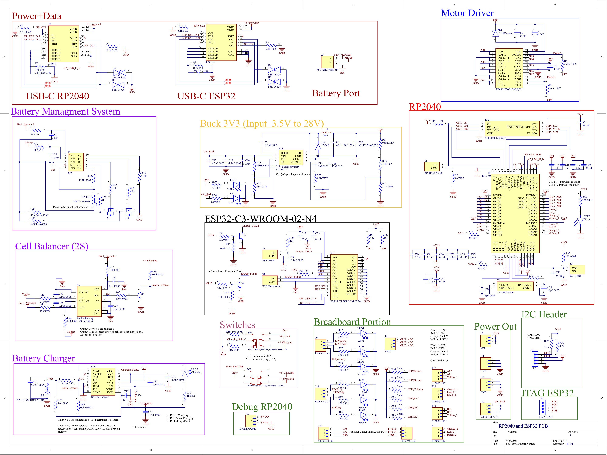

# RP2040 and ESP32 PCB

Dual microcontroller PCB integrating an RP2040 and ESP32-C3 with battery management, motor control, and power regulation.

## PCB

## Features

- RP2040 microcontroller
- ESP32-C3-WROOM-02-N4 module
- USB-C connections for the RP2040 and ESP32
- 2S battery management system
- 2S cell balancing
- Onboard battery charger
- 3.3V buck converter 
- Integrated motor driver
- RP2040 debug header
- I2C expansion header
- Multiple power output headers
- Integrated switches and status LEDs
- Breadboard-style prototyping section
- GPIO breakout connections for external hardware

## Design

The PCB combines two microcontroller platforms on a single board. The RP2040 provides general-purpose processing and extensive GPIO, while the ESP32-C3 provides wireless connectivity and additional processing capability.

The board also integrates the supporting power electronics needed for battery-powered projects, including battery charging, battery protection, cell balancing, 3.3V regulation, and motor control. A prototyping section and several breakout headers allow additional sensors, actuators, and external circuits to be connected directly to the board.

## Schematic

